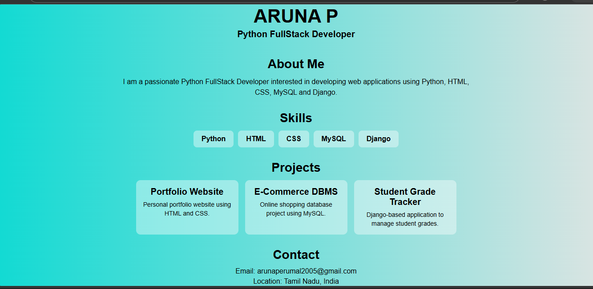

# Personal Portfolio Website

A simple and responsive portfolio website developed using HTML and CSS to showcase my profile, technical skills, projects, and contact information.

## Overview

This portfolio website serves as a personal online profile that highlights my background, skills, and projects. The website is designed with a clean layout and responsive design for better user experience.

## Features

* Personal Introduction
* About Me Section
* Skills Section
* Projects Section
* Contact Information
* Responsive Design
* Clean User Interface

## Technologies Used

* HTML5
* CSS3

## Project Sections

### Home

Displays name and professional title.

### About Me

Provides a brief introduction and career interests.

### Skills

Highlights technical skills including Python, HTML, CSS, MySQL, and Django.

### Projects

Displays project information:

* Portfolio Website
* E-Commerce DBMS
* Student Grade Tracker

### Contact

Provides email and location details.

## Screenshots

### portfolio

## Learning Outcomes

* HTML Page Structure
* CSS Styling
* Responsive Design
* Layout Development
* Portfolio Creation

## Author

Aruna P

B.Tech Information Technology Graduate

Aspiring Python Full Stack Developer
